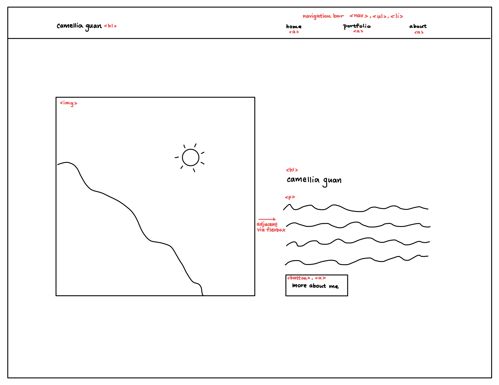
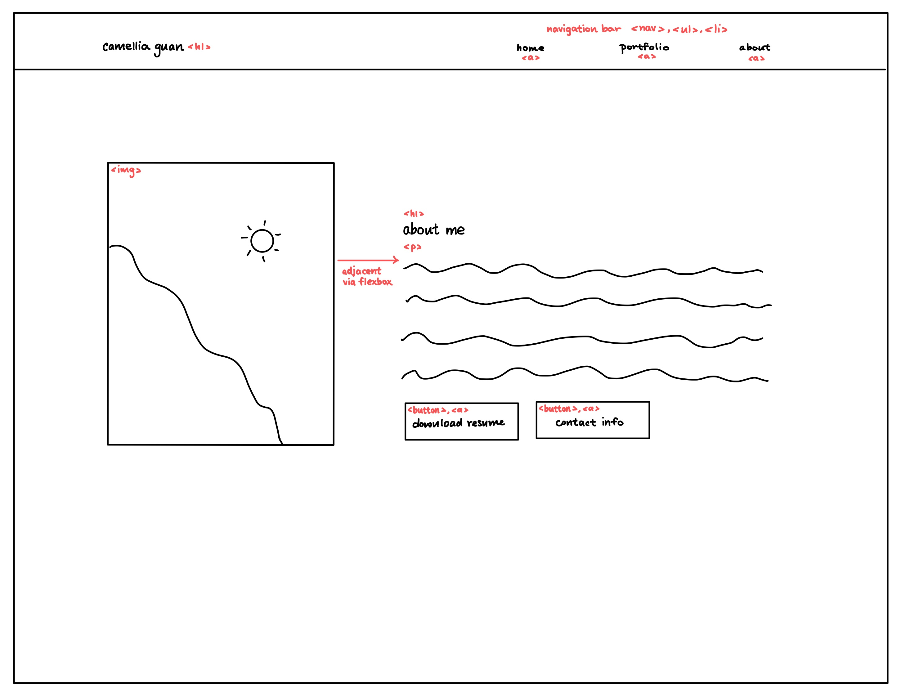

# Personal Website Project

__Purpose of Project__

I wanted to create a personal website that could display any projects that I have created. This website will showcase the web development skills that I have learned, including HTML, CSS, JavaScript, and JQuery. Before I add significant details to a page, I will add a sketch to the design folder so that I have an idea of what the HTML and CSS will look like.

## File Overview

The *File Overview* section outlines the main files of the project.

 ← README.md

 ← index.html

 

### /pages

 ← about.html

 ← portfolio.html

 

### /scripts

 ← jquery-3.6.0.js

 

### /styles

 ← site.css

## Design Choices

The *Design Choices* section explains any choices that I may have made in changing certain parts of the project or any parts of the project that required outside sources.

### index.html

For my index.html page, I decided to have a navigation bar at the top that allows the user to navigate between different pages. The navigation bar will be present on every page I create. The body of the page will consist of an image and a paragraph with some information, with a button that leads to the About page. This is detailed within the designs folder:

Additionally, I tried to make it so the image of myself would fade in upon the page loading. I was able to have it working for my laptop device, but it currently does not work for my phone or tablet (IOS). Changing the CSS transitions to animations allowed for this to work.

 

### about.html

For my about.html page, the navigation bar from the Home page will still be at the top. To contrast the index.html page, I added an image to the right while the text would be on the left. Underneath the text, there are two buttons, one to my contact information, and the other to download my resume. 

**EDIT**: I decided that the image and paragraph would mimic the index.html page instead to provide a better user experience.

 

### portfolio.html

For my portfolio.html page, the navigation bar from the Home page will still be at the top. Keeping the same theme and layout as the other two pages, the image will be at the left and text on the right. A left and right arrow will be above the image and text so that the user can move to the next project or previous project.

**EDIT**: I decided that the arrows would go at the bottom to ensure consistency in spacing at the top.

## Citations

The *Citations* section cites any outside sources that I may have used throughout the project and also describes the part of the project the source was used for.

| Project Section | Description of Section | Source |
| - | - | - |
| | | |
